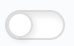

.. _enabling_disabling_user:

Enabling and Disabling a User
=============================

Enabling and disabling a user allows you to quickly activate and deactivate a user. By disabling a user,
you disallow all access to the web user interface but you keep the user's data. When you enable a user,
the user data is re-activated and can start where he or she left off.

To disable or enable a user:

#. In the left menu, select :guilabel:`Manage Accounts`.

   The :guilabel:`Manage Accounts` window appears, leaving you on the :guilabel:`Manage Accounts` tab. If
   not, switch to the proper tab.
#. Look up the user by scrolling in the table or by searching for the user in the search box.
#. In the :guilabel:`Actions` column, click the enable/disable switch.

   * user is enabled: |user_enabled|
   * user is disabled: |user_disabled|

