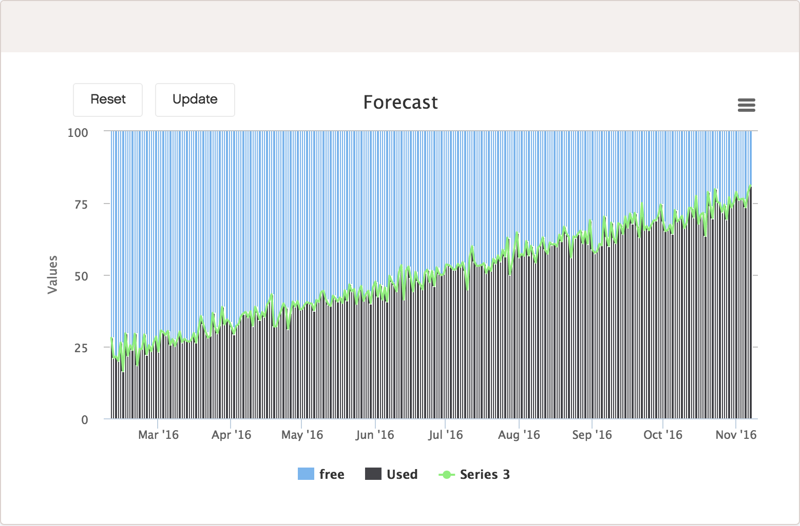
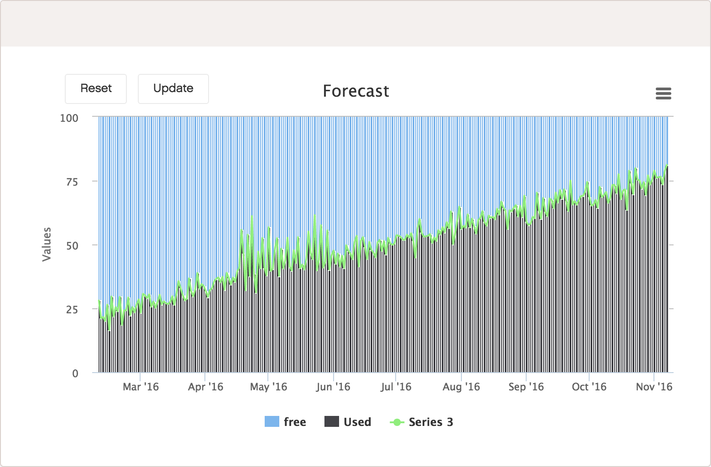
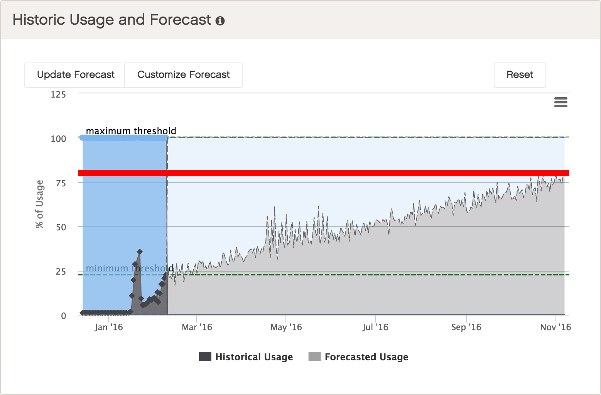

.. _customize_forecast:

Customizing the Forecast
========================

Click :guilabel:`Customize Forecast` to display an editable Forecast chart at the bottom of this panel. 

|forecast_customize|

In the :guilabel:`Forecast` chart, drag any point in the Series line up or down to create a custom usage 
pattern and click :guilabel:`Update` when finished.

|forecast_customized| 

The historical data chart will be updated and the :guilabel:`Forecast` chart disappears.

