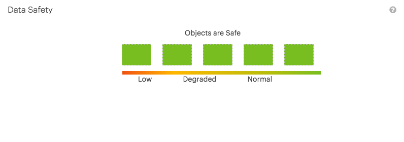
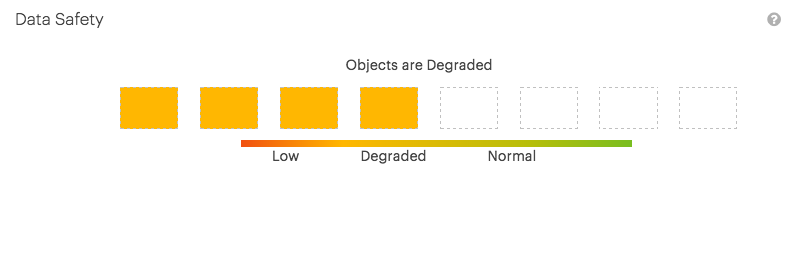
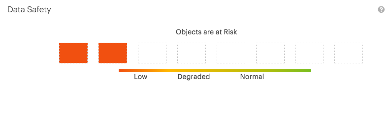

.. _data_safety:

Data Safety
===========

The :guilabel:`Data Safety` panel displays the data safety of the system. In |prod|, the objects are
stored with a data safety policy, 15/5 or 18/8. The first part of the policy indicate on how many disks
the objects are stored, the second part indicates how many of these disks may be unavailable before
|prod| can no longer reconstruct the object.

For example, 15/5 means that the object is divided into 15 segments and each segment is stored on a
different disk. The 5 indicates that |prod| can reconstruct the object with up to 5 missing disks and
thus 5 missing object segments.

In the panel you see the number of disks that may loose and how many disks are unavailable (empty block).

Examples
--------

* Data safety 15/5, all disks available:

  |datasafety_safeobjects|

* Data safety 18/8, 4 disks unavailable, objects are in degraded state:

  |datasafety_degradedobjects|

* Data safety 18/8, 6 disks unavailable, objects are at risk:

  |datasafety_objectsrisk|

