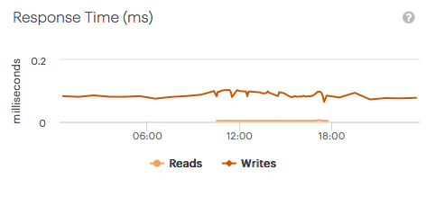

.. _response_time:

Response Time
=============

The :guilabel:`Response Time` panel displays the history of the response times of the system for Read and
Write operations. The graphic can help you in identifying possible network issues.

|response_time|

You can hide one of the operations by clicking one of the operations below the graphic. By hiding one of
the operations, it may occur that the Y-axis is rescaled.

|response_time_put|

