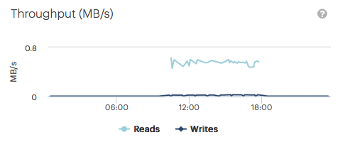
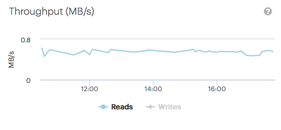

.. _throughput:

Throughput
==========

The :guilabel:`Throughput` panel displays the used bandwidth for Read and Write operations (separated) over
time.

|throughput|

You can hide one of the operations by clicking one of the operations below the graphic. By hiding one of
the operations, it may occur that the scale of the Y-axis is rescaled.

|throughput_get|

