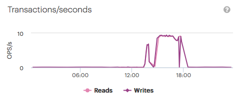
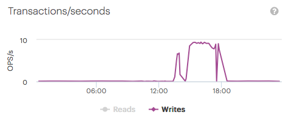

.. _transactions_per_second:

Transactions per Second
=======================

The :guilabel:`Transactions/seconds` panel displays the system's overall operations per second.

|ops_per_sec|

You can hide one of the operations by clicking one of the operations below the graphic. By hiding one of
the operations, it may occur that the Y-axis is rescaled.

|ops_per_sec_put|

