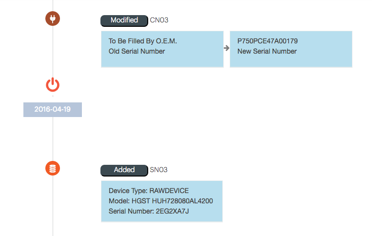

.. _system_hw_changes:

Hardware Changes
================

On the :guilabel:`Hardware Changes` page, you find a time line of all hardware changes that occurred on
the system. The time line only covers the selected period

The time line indicates replaced parts and added parts information and the affected node.

|hw_changes|

On the time line itself you find the affected device or action that has been executed. Hovering your 
mouse over the bullet displays the details of the device, such as type and affected node.

* |hw_changes_se|: disk in a storage enclosure
* |hw_changes_powercycle|: indication of a node restart
