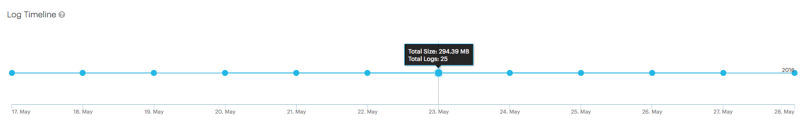

.. _select_log_file:

Selecting a Log or Configuration File
=====================================

In the :guilabel:`Log Timeline` panel, you can choose the day for which you want to consult the log
files. Click a dot on the time line to select a day.

|log_timeline|

When you have selected the day on the timeline, click on the node in the rack, whose log details you want
to consult. If you haven't selected a dot in the :guilabel:`Log Timeline`, the displayed log
files will be the most recent.

There are various log files, depending on the device type:

* :ref:`Controller and Storage Node <log_cn>`
* :ref:`Storage Enclosure <log_stor_enc>`
* :ref:`Switch <log_switch>`

.. note::

   You see only the log files that are actually available on the node.

