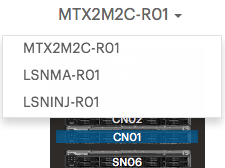

.. _resources_general_info:

About Resources
===============

On the :guilabel:`Resources` tab of a :guilabel:`System` page, you get an overview of the system's 
resources. A resource is any physical component of the system. 
By default the *first* Controller Node of the rack is selected. Click any other device in the rack to
consult its summary and inventory.

The :guilabel:`Resources` tab displays the summary of the rack devices and their full inventory. In case 
that the system is a multi site system, you can select the rack by clicking the name above the rack 
image. This opens a menu with the list of racks in the system.

|select_rack|

