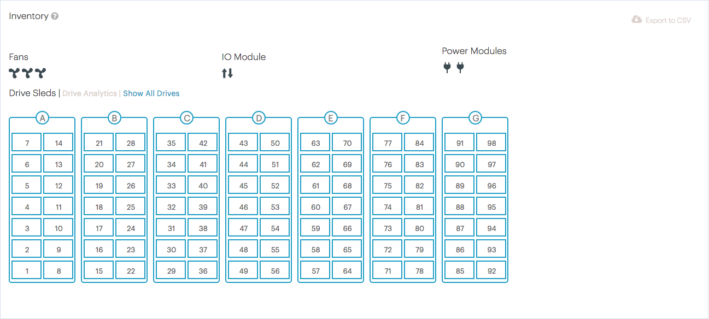

.. _se_inventory:

Storage Enclosure Inventory
===========================

The storage enclosure inventory displays the number of disks, fans, I/O modules and power modules.

.. ifconfig:: persona != 'customer'

   |se_inventory|

.. ifconfig:: persona == 'customer'

   |se_inventory_customer|

Hover over a fan or I/O module to obtain their details.

|se_fan_property| |se_io_property|

In the sleds overview, the drives that need replacement are flagged. The flagging of disks is based on
|prod| statistical analysis.

|drive_replace|

Drive Details
-------------

Click :guilabel:`Show All Drives` to display the disks table.

* :guilabel:`Physical Slot #`: the ID of the slot in the storage enclosure where the disk is located
* :guilabel:`% Used`: percentage of the used disk capacity
* :guilabel:`Type`: type of the disk
* :guilabel:`Logical Name`: name of the logical device on the disk
* :guilabel:`Size`: usable disk space
* :guilabel:`Vendor`: name of the disk manufacturer
* :guilabel:`Product`: model identification of the disk
* :guilabel:`Serial`: serial number of the disk, this can be used for verfication in case of a disk replacement
* :guilabel:`Firmware`: firmware version on the disk
* :guilabel:`Description`: description of the disk

