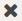

.. _general_usage_pattern:

About the Usage Patterns
========================

The :guilabel:`Usage Patterns` tab on the :guilabel:`System` page contains the graphics of all storage 
related actions. These actions are divided into three levels: storage, compute and network.

At the top of the page, you can filter the data by date and you can select the statistics that you want to
see. By default the following statistics are displayed:

* :ref:`Storage Total Writes <usage_pattern_storage>`
* :ref:`CPU Usage <usage_pattern_compute>`
* :ref:`Rx (Network Received Data) <usage_pattern_network>` 
  
The default data is taken from the last uploaded telemetry data.

Click on :guilabel:`1 week` or :guilabel:`1 Month` to return respectively one week or one month back in
time. 

Available Statistics
--------------------

Besides the default statistics, you can select the following via the :guilabel:`Select Stats` menu 
at the top of the :guilabel:`System` page.

* Total Read/Writes
* Total Reads 
* RAM Usage 
* Total CPU
* Total Received Packets 
* Total Transmitted Packets

Graphics
--------

The performance page is split into three graphics per available statistic.

* In the left panel, you find the statistics in a time series, divided between Controller and Storage
  Nodes.
* On the right you find the issues in chronological order on the Controller Nodes and the Storage Nodes. 

At the bottom of the graphics you can make selections. By default the average (:guilabel:`Avg`) is
displayed, but you can select one or more specific nodes to compare against the average performance of
the nodes. If the name of the node is greyed out, the node is not displayed in the graph.

The time series graphic also contains the issues on the nodes, indicated by orange (error) or yellow 
(warning) icons.

When you click an issue in the time series the bullet turns green and the issue is displayed in the
corresponding controller or storage graphic.

Zoom
----

The zoom level of the time series graphic depends on the date range you have selected at the top of the 
:guilabel:`System` page. In each of the time series graphic, you can zoom in to a specific period. Click 
:guilabel:`Reset zoom` to return to the default zoom level.

Keep in mind that zooming in on the time series may update the scale units on the Y-axis.

For example when the Y-axis has a range of 0 to 50k and you create a selection with the lower boundary at
10k, the origin of the Y-axis then starts at 10k and not the original 0.

Time Series
-----------

The time series graphic displays the statistics over a period in time. You can download (|download_icon|) 
the time series in the following formats:

* PNG
* JPEG
* PDF
* SVG

Issue Details
-------------

The content of the issue details panel may be graphical or textual.

If the content is graphical, you can click on the node names underneath the graphic to disable (grey out) 
or enable (bold) the node's information. 

.. tip::

   It may occur that you have to scroll down in the details panel to view all content.

When you open the details of an issue, click |close_issue_details| to return to the list of issues.

