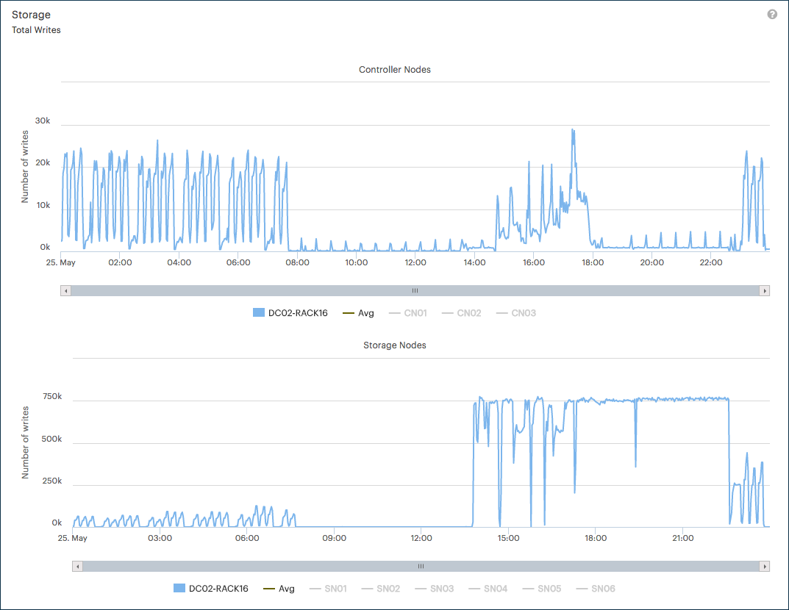

.. _usage_pattern_storage:

Storage Usage Pattern
=====================

|prod| provides three different usage patterns for storage:

* :guilabel:`Total Writes` (default): total number of write operations, averaged across all the Controller Nodes 
  and Storage Nodes. 
* :guilabel:`Total Read/Writes`: total number of read and write operations, averaged across all the Controller
  Nodes and Storage Nodes.
* :guilabel:`Total Reads`: total number of read operations, averaged across all the Controller Nodes and Storage
  Nodes.

Toggle the node name at the bottom of each graphic to display or hide the node's data. This allows you to
compare the specific node's values aagainst the average values.

The Y-axis of the graphics indicates the number of operations. 

The following graphic displays an example of a total writes statistic:

|storage_performance|

