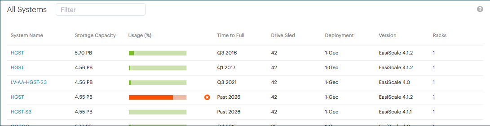

.. _all_systems:

All Systems
===========

.. ifconfig:: persona == 'customer'

   In the :guilabel:`All Systems` panel of the dashboard, you find an overview of your deployed systems.

   The overview excludes systems which do not upload telemetry data.

.. ifconfig:: persona != 'customer'

   In the :guilabel:`All Systems` panel of the dashboard, you find an overview of your deployed systems
   and the ones from your customers.

   The overview excludes systems which do not upload telemetry data.

|all_systems|

You find the following information in the table:

* :guilabel:`System Name`: the name of the system, this cannot be changed as this is taken from the |as|
  deployments.
* :guilabel:`Storage Capacity`: The total *installed* capacity of the system.
* :guilabel:`Usage`: The percentage of storage in use. Hover over the bar to display the actual
  percentage.
* :guilabel:`Time to Full`: The time when the system is predicted to have reached 80% of its storage
  capacity.
* :guilabel:`Drive Sled`: The total number of Sleds per system.
* :guilabel:`Deployment`: Indicates the type of the system, single site (1-Geo) or multi site (3-Geo).
* :guilabel:`Version`: Displays the installed version of the |as| on the system.
* :guilabel:`Racks`: The total number of racks that make up a system.

To reduce the number of records in the displayed table, you can add a free text query in the
:guilabel:`Filter` field. Once you start typing, the table is updated with matching records.

For example, if you type :kbd:`4.1`, the table automatically shows all systems that use version 4.1, but
also systems that would have a capacity, which contains 4.1, for example 4.19 PB.

