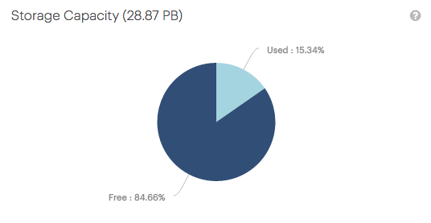

.. _storage_capacity:

Storage Capacity
================

.. ifconfig:: persona != 'customer'

   The :guilabel:`Storage Capacity` panel on the customer's dashboard displays a pie chart with the 
   percentages of the used capacity and the free storage capacity.

   The information is aggregated over all systems of a customer.

.. ifconfig:: persona == 'customer'

   The :guilabel:`Storage Capacity` panel on your dashboard displays a pie chart with the percentages of 
   the used capacity and the free storage capacity.

   The information is aggregated over all your systems.

|storage_capacity|

