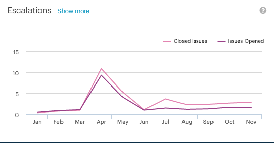

.. _escalations:

Customer Escalations
====================

The :guilabel:`Escalations` panel displays the number of reported issues per month and the number of
resolved issues per month.

|customer_escalations|

By default, the opened and closed issues are displayed in the graphic. You can disable one of the 
graphics by clicking the :guilabel:`Closed Issues`/:guilabel:`Issues Opened` labels above the graphic. If 
an issue type is not displayed in the graphic, the label is greyed out.

|escalations_deselected|

Escalation Details
------------------

When you click :guilabel:`Show more` in the :guilabel:`Escalations` panel, you see a table with the 
details of the customer's filed issues.

* :guilabel:`Issues`: Issue ID and short description.
* :guilabel:`Opened`: Date when the issue was filed.
* :guilabel:`Closed`: Date when the issue was closed.
* :guilabel:`Opened`: ?

To quickly find your information, you can also filter the data with a free text query in the
:guilabel:`Filter` box.

