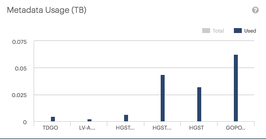

.. |metadata_usage_total| image:: ../_static/metadata_usage_total.png

.. _metadata_usage:

Metadata Usage
==============

The :guilabel:`Metadata Usage` panel displays the capacity and used capacity of the metadata, per 
deployment. The values are expressed in terabyte. 

By default the total reserved capacity for the object's metadata is displayed in the graphic.

|metadata_usage_total|

To retrieve the actual used storage by the metadata, deactivate the total graphic by clicking
:guilabel:`Total` above the graphic.

|metadata_usage_used|

