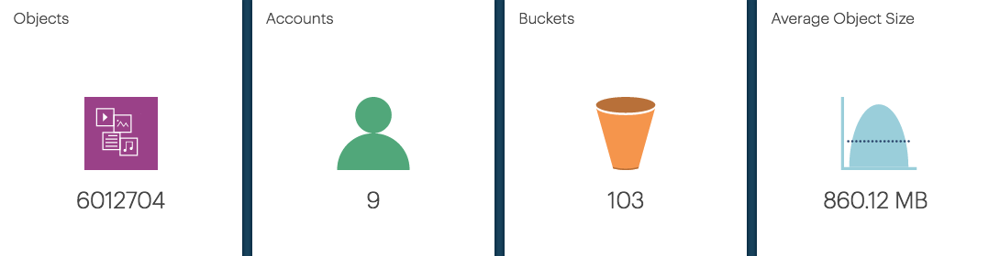

.. _overall_statistic:

Overall System Statistic
========================

At the bottom of the customer dashboard, you find the following overall statistics of the customer:

* :guilabel:`Object Count`: The total number of objects, stored on all setups of the customer.
* :guilabel:`S3 Users`: The total number of S3 users of the customer.
* :guilabel:`Total Buckets`: The total number of buckets that are deployed by this customer.
* :guilabel:`Average Object Size`: The average object size of all objects.

|overall_statistic|

