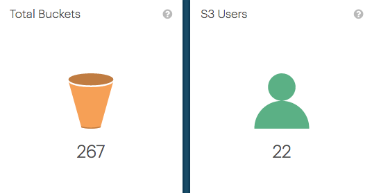
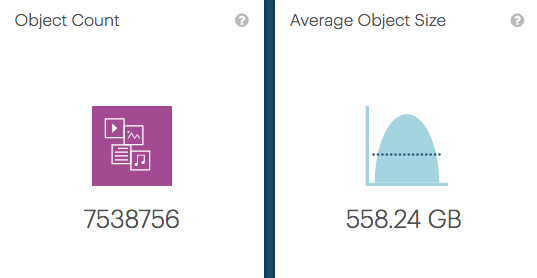

.. _overall_statistic:

Overall System Statistics
========================

.. ifconfig:: persona != 'customer'

   There are four overall statistics of the customer, the values are aggregated over all its systems:

   * :guilabel:`Total Buckets`: The total number of S3 buckets that are deployed by this customer.
   * :guilabel:`S3 Users`: The total number of S3 users of the customer.
   * :guilabel:`Object Count`: The total number of objects, stored in all buckets of the customer.
   * :guilabel:`Average Object Size`: The average object size of all objects, which is the total used
     storage capacity divided by the object count.

.. ifconfig:: persona == 'customer'

   There are four overall statistics of which the values are aggregated over all your systems:

   * :guilabel:`Total Buckets`: The total number of S3 buckets aggregated over all your systems.
   * :guilabel:`S3 Users`: The total number of S3 users across your systems.
   * :guilabel:`Object Count`: The total number of objects, stored in all your buckets.
   * :guilabel:`Average Object Size`: The average object size of all objects, which is the total used
     storage capacity divided by the object count. 

|overall_statistic_buckets_users|

|overall_statistic_objects|

