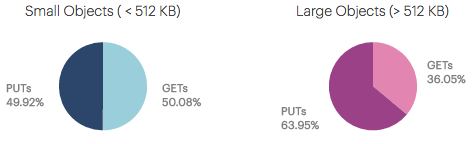
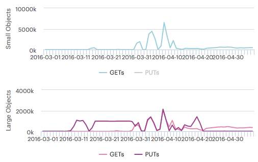

.. _workload:

Workload
========

.. ifconfig:: persona != 'customer'

   The :guilabel:`Workload` panel displays the workload of the aggregated systems of a customer. In the
   panel, you find two pie-chart graphics and two time-line graphics.

.. ifconfig:: persona == 'customer'

   The :guilabel:`Workload` panel displays the workload of all your systems. In the panel, you find two 
   pie-chart graphics and two time-line graphics.

Pie-Chart Graphics
------------------

The pie-chart graphics display the percentage of Read and Write operations, but separated between small
objects, files less than 512 KB, and large objects, files larger than 512 KB.

|workload_piechart|

Time Line Graphics
------------------

In the time line graphics, you find the number of Read and Write operations over time, also separated for
small and large objects.

|workload_timeline|

By default, the Read and Write operations are displayed. You can disable one of the graphics by clicking the
:guilabel:`Writes`/:guilabel:`Reads` lables below the graphic. If an operation is not shown in the graphic, 
it appears greyed out.

|workload_deselected|

