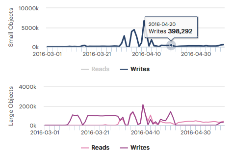

.. |workload_piechart| image:: ../_static/workload_piechart.png

.. _workload:

Workload
========

.. ifconfig:: persona != 'customer'

   The :guilabel:`Workload` panel displays the total workload across all systems of a customer. The pie
   charts show the distribution of read and write operations across small and large objects. The time
   graphics of the small and large objects, show the number of read and write operations during the
   period.

.. ifconfig:: persona == 'customer'

   The :guilabel:`Workload` panel displays the total workload across all your systems. The pie charts 
   show the distribution of read and write operations across small and large objects. The time graphics
   of the small and large objects, show the number of read and write operation during the period.

Pie-Chart Graphics
------------------

The pie-chart graphics display the percentage of Read and Write operations, but separated between small
objects, files less than 512 KB, and large objects, files larger than 512 KB.

|workload_piechart|

Time Line Graphics
------------------

In the time line graphics, you find the number of Read and Write operations over time, also separated for
small and large objects.

|workload_timeline|

By default, the Read and Write operations are displayed. You can disable one of the graphics by clicking the
:guilabel:`Writes`/:guilabel:`Reads` lables below the graphic. If an operation is not shown in the graphic, 
it appears greyed out.

|workload_deselected|

