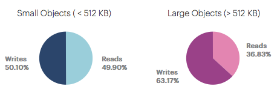

.. |workload_timeline| image:: ../_static/workload_timeline.png

.. _workload:

Workload
========

The :guilabel:`Workload` panel displays the workload of the aggregated systems of a customer. In the
panel, you find two pie-chart graphics and two time-line graphics.

Pie-Chart Graphics
------------------

The pie-chart graphics display the percentage of PUT and GET operations, but separated between small
objects, files less than 512 KB, and large objects, files larger than 512 KB.

|workload_piechart|

Time Line Graphics
------------------

In the time line graphics, you find the number of PUT and GET operations over time, also separated for
small and large objects.

|workload_timeline|

By default, the PUT and GET operations are displayed. You can disable one of the graphics by clicking the
:guilabel:`GETs`/:guilabel:`PUTs` below the graphic. If an operation is not shown in the graphic, it
appears greyed out.

