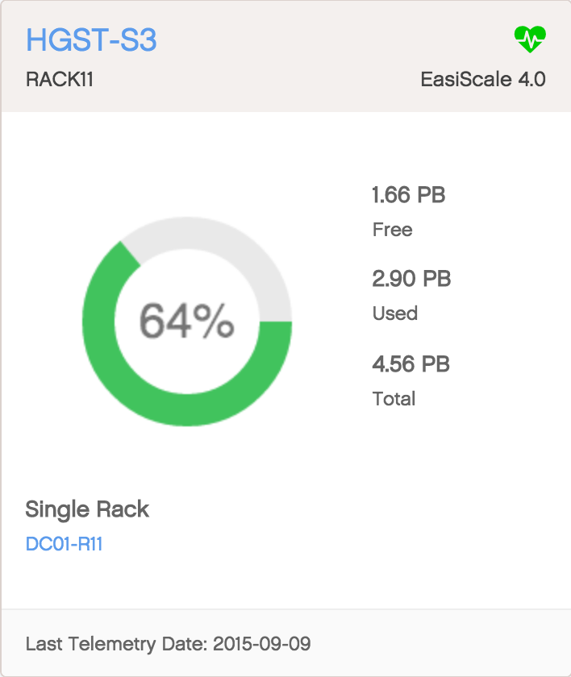

.. |dashboard_grid| image:: ../_static/dasboard_grid.png
   :scale: 75%

.. _dashboard:

Dashboard
=========

The Peregrine :term:`Dashboard` shows all setups in all data centers all over the world. It is also the
default view when you log in.

Panel View
----------

The default view on the dashboard is the panel view. In this view, a panel corresponds with one setup. 

|dashboard_panel|

A panel gives you a brief overview of a setup, showing the following information:

In the top border of the panel you find:

* Name of the setup
* Rack name in which the setup is installed
* **system health**: icon indicating the health of the setup (|panel_health|).
* Software version of the setup

In the center of the panel you find the storage information:

* percentage of used storage
* **total storage**: maximum amount of data that can be stored in the setup.
* **used storage**: amount of storage in use.
* **free storage**: amount of available storage in the setup.
* **setup type**: single rack, 3-Geo single rack, single geo 3 racks, ... 
* identification of the location of the setup

In the bottom border you can see the date and time of the latest update of the statistics.

Grid View
---------

In vel quam sit amet mauris suscipit ullamcorper tempor vel nisl. Praesent sed euismod ligula. Curabitur
velit ligula, gravida non tristique ut, tristique eu magna. Sed ac mauris ex. Duis ullamcorper malesuada
augue a viverra. Curabitur vitae libero in lacus gravida egestas et sed felis. Suspendisse dictum euismod
sodales. Integer rutrum porttitor leo, id molestie est mattis in. Nunc mollis felis nisl, semper sodales
orci bibendum viverra. Cras lacinia elementum faucibus.
