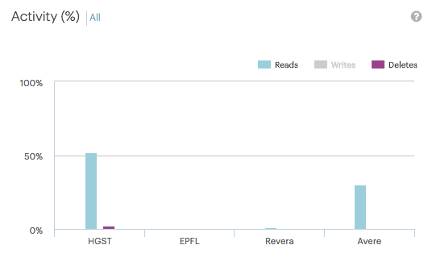
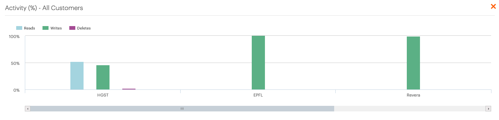

.. _activity:

Activity
========

The :guilabel:`Activity` panel displays the distribution of total transactions across read, write and 
delete operations and per customer.

You can toggle the appearance of a transaction by clicking the transaction type on top of the graphic.

|activity_transaction_deselected|

To display all customers in one graphic, click :guilabel:`All`. This opens a popup window with an
identical graphic including all customers. Use the horizontal scrollbar to scroll through the graphic.

|activity_all|

