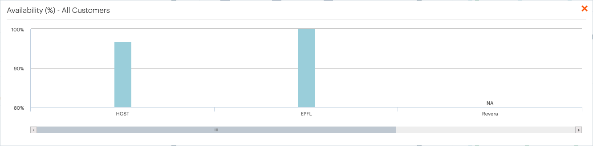

.. _availability:

Availability
============

The :guilabel:`Availability` panel displays the percentage of time that a customer's |as| systems are
available for S3 operations. The percentage is calculated for all systems of a customer. 

To display all customers in one graphic, click :guilabel:`All`. This opens a popup window with an
identical graphic including all customers. Use the horizontal scrollbar to scroll through the graphic.

|availability_all|

