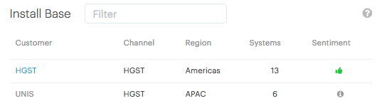

.. |sentiment_info| image:: ../_static/sentiment_info.png

.. _install_base:

Install Base
============

The :guilabel:`Install Base` panel displays a table with all your customers along with their sales
channel and their number of installations.

Install Base Table
------------------

.. ifconfig:: persona == 'oem'

   The content of the :guilabel:`Install Base` table depends on the user who is logged in. See the section
   :ref:`User Roles <user_roles_oem>` for more information about users.

.. ifconfig:: persona == 'admin'

   The content of the :guilabel:`Install Base` table depends on the user who is logged in. See the section
   :ref:`User Roles <user_roles_admin>` for more information about users.

|install_base|

* :guilabel:`Customer`: Displays the name of the customer.
* :guilabel:`Channel`: The Channel is the sales channel who is responsible for the customer.
* :guilabel:`Region`: The Region indicates where the customer's systems are installed.
* :guilabel:`Systems`: The Systems column displays the number of systems that a customer has deployed.
* :guilabel:`Sentiment`: Coming soon...

You can sort the table by column. Click the column header to sort the data in ascending or descending
order.

Filtering Data
--------------

To easily find information, you can also filter the data.

To filter the data, you can type any text in the :guilabel:`Filter` field. The text can contain any
information: number of systems, customer name, channel name, or region. Once you start typing in the
:guilabel:`Filter` field, the table is automatically updated with the matching data.

