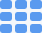

.. _install_base_dashboard:

Install Base Dashboard
======================

The |prod| :term:`Dashboard` shows all setups in all data centers all over the world. It is also the
default view when you log in.

There are two views on the dashboard, :ref:`panel view <panel_view>` and :ref:`grid view <grid_view>`, where the latter is the default view.

You can switch between these views in the upper right corner of the dashboard:

* |select_panel_view|: select the panel view
* |select_grid_view|: switch to grid view

.. toctree::

   panel_view.rst
   grid_view.rst

