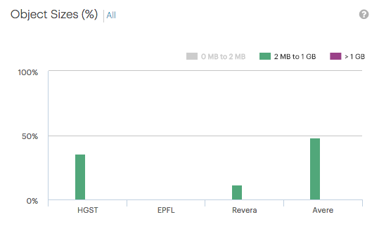
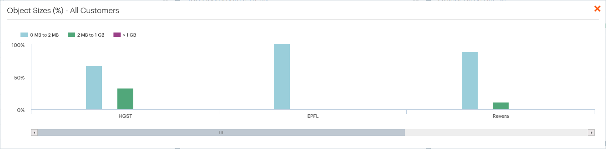

.. _object_sizes:

Object Sizes
============

The :guilabel:`Object Sizes` panel displays, per customer, the percentage of stored objects by size.
This is the distribution of total objects stored across different object sizes.

The objects are divided into three size categories:

* :guilabel:`0 MB to 2 MB`
* :guilabel:`2 MB to 1 GB`
* :guilabel:`> 1GB`

You can toggle the appearance of the size category by clicking the category.

|object_sizes_category_deselected|

To display this graphic for all customers, click :guilabel:`All`. This opens a popup window with an 
identical graphic with all customers. Use the horizontal scrollbar to scroll through the graphic.

|object_sizes_all|

