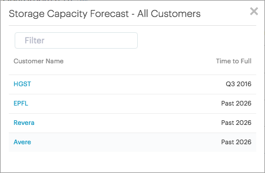

.. _storage_capacity_forecast:

Storage Capacity Forecast
=========================

The :guilabel:`Storage Capacity Forecast` panel predicts when a customer's aggregated used capacity will
consume 80% of its total storage capacity.
This prediction is based on the analysis of historic and forecasted usage consumption. 

You can sort the table in ascending and descending order, by clicking any of the two column headers. 

Click :guilabel:`All` to open the table for all customers. In this table you can filter the data to find
the desired information in a fast and easy way.

|capacity_forecast_all|

