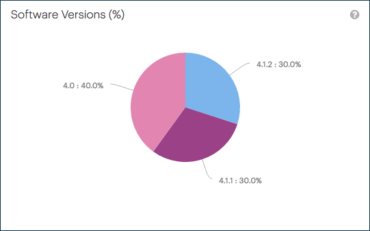

.. _sw_versions:

Software Versions
=================

The :guilabel:`Software Versions` panel displays the distribution of all systems across different
versions of the |as| software. The chart does not include the systems that do not upload telemetry data.

This graphic is a global overview, not on a customer basis.

|sw_versions|

