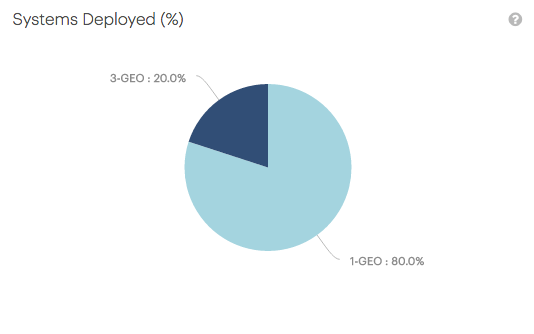

.. _systems_deployed:

Systems Deployed
================

The :guilabel:`Systems Deployed` panel displays the distribution of |as| systems across single site 
(:guilabel:`1-GEO`) and multi site (:guilabel:`3-GEO`) deployments.

The chart excludes the deployments that do not upload telemetry data.

|systems_deployed|

