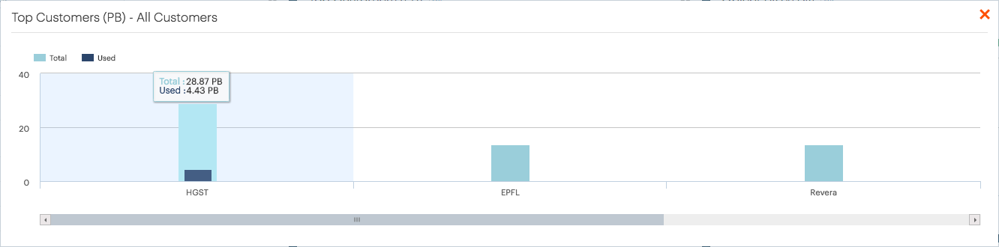

.. _top_customers:

Top Customers
=============

The :guilabel:`Top Customers` panel identifies the customers with the largest storage capacities (in
petabytes). The storage capacity excludes |as| systems which do not upload telemetry data.
The graphic also indicates the used storage capacity. By default the top ten customers are shown and this 
top ten is used in all other charts on the :guilabel:`Install Base` dashboard.

To display all customers in one graphic, click :guilabel:`All`. This opens a popup window with an
identical graphic including all customers. Use the horizontal scrollbar to scroll through the graphic.

|top_customers_all|

