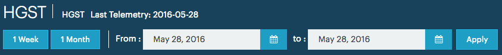
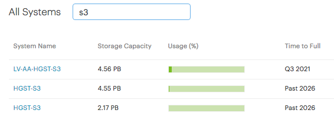
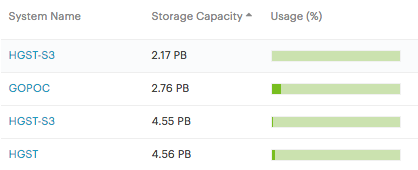

.. |calendar| image:: ../_static/calendar.png

.. _filtering_data:

Filtering Data
==============

The amount of data that is available can be very large. To help you find the data that you're looking for
you can filter these data.

Filtering by Date
-----------------

To filter the data, you can select a time period for retrieval. The default period is the last day of 
retrieving the statistics from the |as| systems.

|filter_by_date|

The :guilabel:`1 Week` or :guilabel:`1 Month` buttons allow you to return back in time with respectively
one week and one month. Every new click returns one week or month further back in time.

You can also set a custom period by clicking the calendar icon (|calendar|) in the :guilabel:`From` and 
:guilabel:`to` field and select the proper dates. When you have set the start and end date, click 
:guilabel:`Apply`. 

The data are updated for the selected period.

Filtering by Text
-----------------

In some panels, you find a large list of items, which makes it often hard to find the data that you're
looking for. To help you locate the desired information, such panels have a filter box in which you can 
search for the necessary data. 

|filter_by_text|

This filter box is case-insensitive and returns any match, regardless the column in which the query data 
is retrieved.

Ordering by Column
------------------

You can order all data, displayed in tables, in ascending or descending order. To do so, click the
column header whose information you want to order; click the header again to reverse the order.

In the next example, the data are displayed by :guilabel:`Storage Capacity` in ascending order.

|order_column_ascending|

