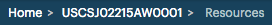

.. _navigation:

Navigation
==========

.. ifconfig:: persona != 'customer'

   To easily navigate through the various sections in |prod|, there is a breadcrumb trail below the top bar.
   
   |breadcrumb|
   
   #. Home page of |prod|, which is the :ref:`Install Base Dashboard <install_base_dashboard>`.
   #. The second item of the breadcrumb is the name of the :ref:`customer <customer_dashboard>`.
   #. The third item is the name of the :ref:`customer's system <as_system>`.
   #. The possible fourth item of the breadcrumb is the name of a subsection of a system's dashboard page.
   
   Click any of the items to return to the respective dashboard. For example, if you click the second item
   in the breadcrumb, you return to the customer's dashboard.

.. ifconfig:: persona == 'customer'

   To easily navigate through the various sections in |prod|, there is a breadcrumb trail below the top bar.
   
   |breadcrumb_customer|
   
   #. Home page of |prod|, which is the dashboard of your :ref:`account <customer_dashboard>`.
   #. The second item is the name of the :ref:`selected system <as_system>`.
   #. The possible third item is the name of the subsection of a system's dashboard.
   
   Click any of the items to return to the respective dashboard. For example, if you click the second item
   in the breadcrumb, you return to the selected system.
