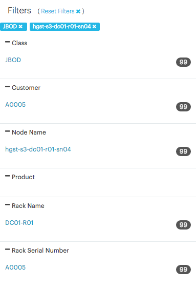

.. |search| image:: ../_static/search.png

.. |search_inventory_result| image:: ../_static/search_inventory_result.png

.. _searching_in_peregrine:

Searching in |prod|
===================

You can quickly search for information in |prod| by using opening the search box with the |search| icon.

On the left of the search box, you have a menu with three choices:

* :guilabel:`System Log`
* :guilabel:`Inventory`
* :guilabel:`Events`

Type a customer ID, node name, Linux error, device name, and so on. For example, "warning A0010 SN01",
"warning md2 EXT4-fs", "warn_slowpath_common". Press :kbd:`Enter` for suggestions. Type "|" for OR. Press 
:kbd:`Enter` twice to start the search.

For example, if you want to look for inventory of a system with the name HGST-S3:

#. Click |search|.
#. Select :guilabel:`Inventory` on the left of the search box.
#. Enter "A0005" and press :kbd:`Enter` twice to start the search.

   The main panel displays all items which have "A0005" as information. As shown in the example below, 
   |prod| provides suggestions when you type your query.

   |search_inventory_result|

Filtering Search Results
------------------------

In the search result window, you can narrow down the number of results by selecting extra filters.

The filters are located on the right-hand side of the results window. Each of the items give an
indication on the number of results it will return when selecting the filter item. 

Click the item to activate the item as filter.

|filter_search_results|

To clear the item, click the item at the top of the filter box or clear all filter items by clicking
:guilabel:`Reset Filters`.

