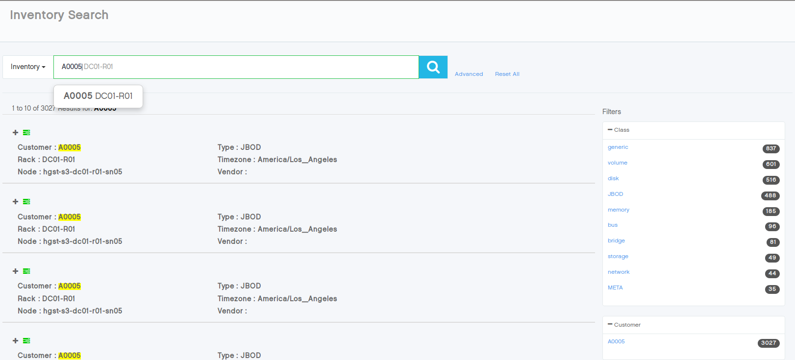

.. |search| image:: ../_static/search.png

.. _searching_in_peregrine:

Searching in |prod|
===================

You can quickly search for information in |prod| by using opening the search box with the |search| icon.

On the left of the search box, you can choose between three sections:

* System Log
* Inventory
* Amplievents

Type a customer ID, node name, Linux error, device name, and so on. For example, "warning A0010 SN01",
"warning md2 EXT4-fs", "warn_slowpath_common". Press Enter for suggestions. Type "|" for OR. Press Enter
twice to start the search.

For example, if you want to look for inventory of a system with the name A0005:

#. Click |search|.
#. Select :guilabel:`Inventory` on the left of the search box.
#. Enter "A0005" and press :kbd:`Enter` twice to start the search.

   The main panel displays the inventory of system HGST-S3. As shown in the example below, |prod|
   provides suggestions when you type your query.

   |search_inventory_result|

In the search result window, you can narrow down the number of results by selecting extra filters, which
indicate the number of results.

