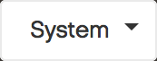

.. |search| image:: ../_static/search.png

.. |full_screen| image:: ../_static/full_screen.png

.. _ui_components:

UI Components
=============

The |prod| interface is divided in three main sections:

* the top bar with the search function, system selection and profile menu.
* the left menu panel to select the information that you want to examine.
* the main panel which displays the requested data.

Top Bar
-------

In the top bar you find the following components:

* |collapse_expand|: icon to collapse or expand the left menu panel
* |search|: icon to open the search window
* |alert|: @todo what's the function of this icon?
* |system_selection|: drop-down menu to select a system
* |full_screen|: icon to open |prod| in full screen mode

Menu
----

On the left side you find the |prod| menu for quick access to reports, analysis and so on.

The content of the menu varies according the selection you make in either this menu or in the main panel.

Main Panel
----------

The main panel displays the desired system information. The information is mainly displayed in a
graphical way. 

All graphics can be downloaded in various formats (PNG, JPEG, PDF, SVG) or directly sent to a printer.

