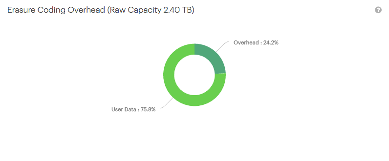

.. _erasure_coding_overhead:

Erasure Coding Overhead
=======================

:term:`Erasure Coding` generates a limited amount of storage overhead to be able to rebuild objects in 
case of disk failures.

In :guilabel:`Erasure Coding Overhead` report you can see the ratio between the actual user data capacity 
and the erasure coding overhead capacity. The panel label also indicates the raw capacity that is
reserved for metadata on the system.

|erasure_coding_overhead|

