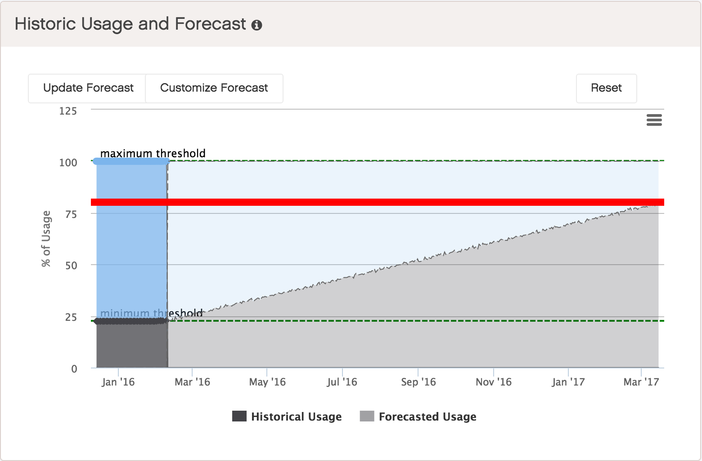

.. |usage_threshold| image:: ../../_static/usage_threshold.png
   :scale: 75%

.. _historic_usage:

Historic Usage and Forecast
===========================

@todo: forecast on rack or setup level?

The Forecast predicts storage utilization in upcoming months (light grey) based on this system's 
historical data (dark grey). The red line is the usage threshold. If the prediction is close to 
this threshold, increase the system's capacity.

The default threshold is 80% of the total capacity, but you can lower or raise it by moving the red line
up or down.

|forecast|

The :guilabel:`Usage Threshold` graphic displays the current storage usage.

|usage_threshold|

