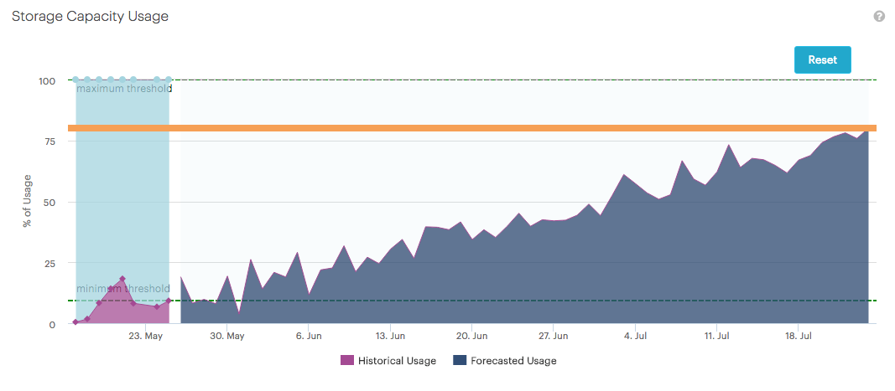
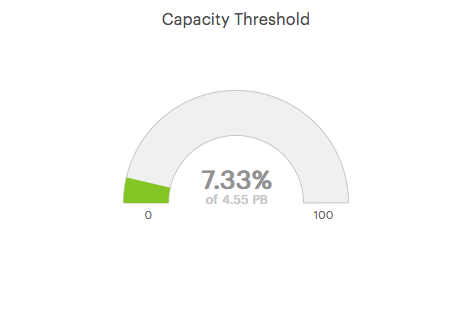

.. _storage_capacity_usage:

Storage Capacity Usage
======================

The :guilabel:`Storage Capacity Usage` panel visualizes the forecast of the storage usage and when the
storage capacity will reach its threshold. The threshold is by default set on 80%.

This graphic allows you to closely monitor the evolution of the storage consumption and to plan the
increase of the system's storage capacity.

The threshold of 80% is displayed by the orange line in the panel. You can increase or decrease the
threshold line, this automatically updates the date of reaching the storage capacity threshold. Click
:guilabel:`Reset` to reset the threshold to 80%.

|forecast|

The :guilabel:`Capacity Threshold` graphic displays the current storage usage.

|capacity_threshold|

