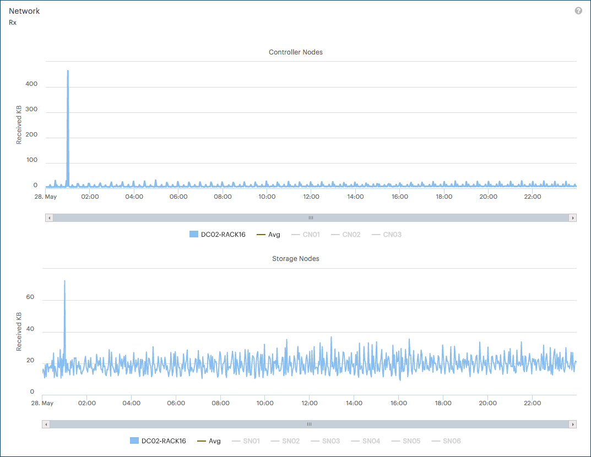

.. _network_performance:

Network Performance
===================

To consult the network performance of a system, you have three statistics:

* **Rx** (default): received amount of data in KB, averaged across all Controller Nodes and Storage
  Nodes.
* **Total Received Packets**: total amount of received packets, averaged across all Controller Nodes and
  Storage Nodes.
* **Total Transmitted Packets**: total amount of transmitted packets, averaged across all Controller
  Nodes and Storage Nodes.

The following graphic is an example of the received data network performance:

|network_performance|

