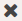

.. |download_icon| image:: ../../_static/download_graph.png

.. _general_usage_pattern:

About the Usage Patterns
========================

The :guilabel:`Usage Patterns` tab on the :guilabel:`System Health` page of a system contains the graphics 
of all storage related actions. These actions are divided into three levels: storage, compute and 
network.

On top of the page you can filter the data by date and you can select the statistics that you want to
see. By default the :ref:`Storage Total Writes <usage_pattern_storage>`, :ref:`CPU Usage
<usage_pattern_compute>` and :ref:`Network Received Data <usage_pattern_network>` are displayed.

Available Statistics
--------------------

Besides the default statistics, you can select the following ones via the :guilabel:`Select Stats` menu 
on top of the :guilabel:`System Health` page.

* Total Read/Writes
* Total Reads 
* RAM Usage 
* Total CPU
* Total Received Packets 
* Total Transmitted Packets

Graphics
--------

The performance page is split into three graphics per available statistic.

* In the left panel, you find the statistics in a time series way, divided between Controller and Storage
  Nodes.
* On the right you find the issues in chronological order on the Controller Nodes and the Storage Nodes. 

At the bottom of the graphics you can make selections. By default the average (:guilabel:`Avg`) is
displayed, but you can select one or more nodes to investigate the performance of specific nodes. 
If the name of the node is greyed out, the node is not displayed in the graph.

The time series graphic contains also the issues on the nodes. The color of the issue indicates the
severity of the issue:

* **yellow**
* **orange**

@todo: what are the color codes?

When you click an issue in the time series the bullet turns green and the issue is displayed in the
corresponding controller or storage graphic.

Time Series
-----------

The time series graphic displays the statistics over a period in time. The zoom level of the time series 
graphic depends on the date range you have selected on top of the :guilabel:`System Health` page. In each 
of the time series graphic, you can zoom in to a specific period. Click :guilabel:`Reset zoom` to return 
to the default zoom level.

Keep in mind that zooming in on the time series may update the scale units on the Y-axis.

For example when the Y-axis has a range of 0 to 50k and you create a selection with the lower boundary at
10k, the origin of the Y-axis then starts at 10k and not the original 0.

You can download (|download_icon|) the time series in the following formats:

* PNG
* JPEG
* PDF
* SVG

Issue Details
-------------

The content of the issue details panel depends on the type of information. This information may be
graphical or textual.

If the content is graphical, you can click on the node names underneath the graphic to disable (greyed 
out) or enable (bold) the node's information. 

.. tip::

   It may occur that you have to scroll down in the details panel to view all content.

When you open the details of an issue, click |close_issue_details| to return to the list of issues.
