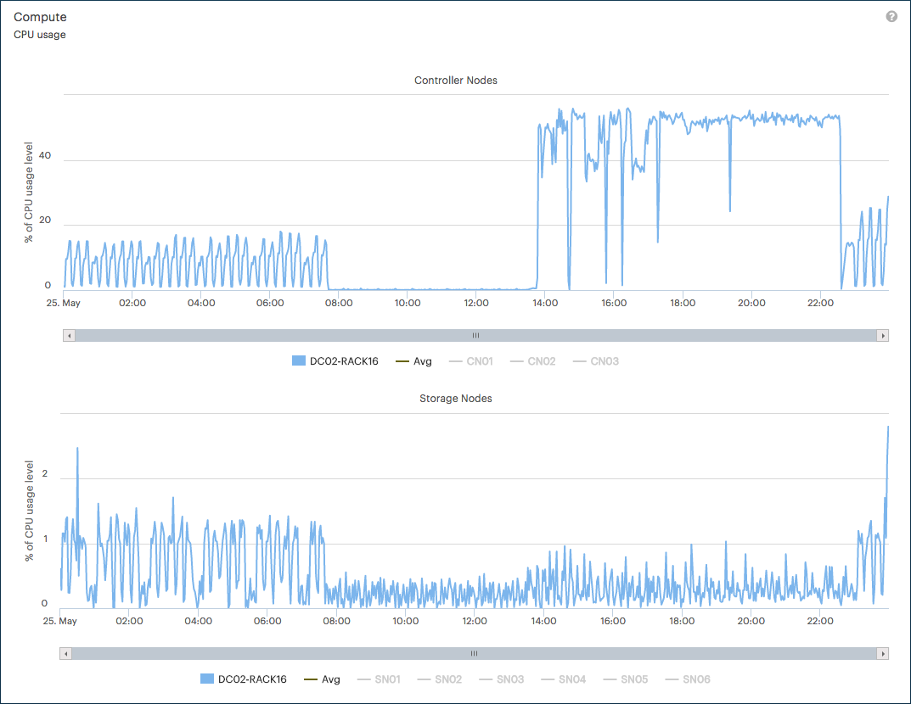

.. _usage_pattern_compute:

Compute Usage Pattern
=====================

On Compute level, |prod| captures the following data:

* :guilabel:`CPU usage` (default): CPU utilization, averaged across all Controller and Storage Nodes
* :guilabel:`RAM`: available memory over time, averaged across all Controller and Storage Nodes
* :guilabel:`Total CPU usage`: total CPU utilization

@todo: what's difference between cpu usage and total cpu usage

The following graphic gives you an example of the CPU usage statistics:

|compute_performance|

