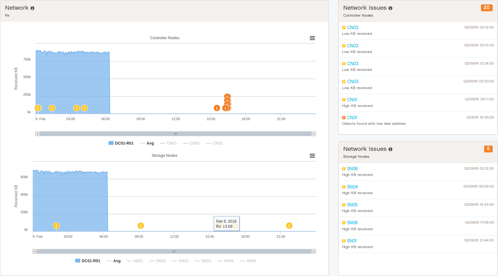

.. _usage_pattern_network:

Network Usage Pattern
=====================

To consult the network usage pattern of a system, you have three statistics:

* :guilabel:`Rx` (default): received amount of data in KB, averaged across all Controller Nodes and Storage
  Nodes.
* :guilabel:`Total Received Packets`: total amount of received packets, averaged across all Controller Nodes and
  Storage Nodes.
* :guilabel:`Total Transmitted Packets`: total amount of transmitted packets, averaged across all Controller
  Nodes and Storage Nodes.

The following graphic is an example of the received data network performance:

|network_performance|

